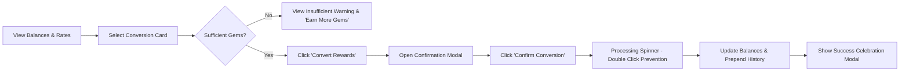

# 💎 VELOOP Rewards — Exchange Center Redesign

A premium, fintech-inspired **Reward Conversion Center** built for VELOOP Rewards. This application enables users to convert their earned **Gems** into **VEs** through predefined, transparent conversion opportunities.

Designed with a high-end dark aesthetics (`#161827`), glassmorphic cards, 3D reward graphics, interactive tooltips, and fluid micro-animations.

---

## 📌 Table of Contents
- [Project Overview](#project-overview)
- [Exchange Center Concept](#exchange-center-concept)
- [Key Features](#key-features)
- [Exchange Logic](#exchange-logic)
- [User Flow](#user-flow)
- [Component Architecture](#component-architecture)
- [Technology Stack](#technology-stack)
- [Local Development & Setup](#local-development--setup)
- [Build Instructions](#build-instructions)
- [Responsive Design](#responsive-design)
- [Animation System](#animation-system)
- [Future Backend Integration](#future-backend-integration)
- [Deployment Guide](#deployment-guide)

---

## 🎯 Project Overview
The **Exchange Center** is a core reward conversion feature within VELOOP Rewards. Users earn Gems through eligible activities and can exchange them for VEs (VELOOP Rewards' virtual reward currency).

> ⚠️ **Important:** This is strictly a **Reward Conversion Center** and NOT a cryptocurrency exchange. It avoids trading jargon like order books, market prices, charts, ROI, liquidity pools, or buy/sell terminology.

---

## 💎 Exchange Center Concept
Instead of displaying plain repetitive cards, the page is built as a **Reward Conversion Vault**:
1. **Sidebar Navigation Shell:** Complete VELOOP Rewards platform shell with active Exchange Center navigation, level badge, and "Earn More Gems" prompt.
2. **Hero Vault Stage:** Dynamic 3D visual featuring floating Gems and VE Coins with real-time balance overview cards and "What are these?" explanations.
3. **Color-Coded Conversion Cards:** Predefined conversion tiers (Daily, Reward, Value, Premium) with 3D gem assets (`purple`, `blue`, `green`, `orange`), badges, and state-aware CTA buttons.
4. **Interactive 5-Step Process:** Clear visual step guide (01 Earn Gems → 02 Choose Conversion → 03 Review Exchange → 04 Confirm → 05 Receive VEs).
5. **Recent Conversions & Rules:** Live updating history with status indicators (`Completed ✓` / `Failed`) alongside platform rule checklists and 3D shield check imagery.

---

## ✨ Key Features
- **Real-Time Balance Updates:** Deducts Gems and credits VEs upon successful exchange.
- **State-Aware CTAs & Insufficient Gems Handling:** Disables conversions and highlights missing Gems (`You need X more Gems`) with an `Earn More Gems` call-to-action.
- **Double-Conversion Prevention:** Button becomes disabled with a loading spinner (`Converting...`) while requests process.
- **Interactive Tooltips `(i)`:** Accessible popovers explaining Gems, VEs, Exchange Rates, and Rules across the interface.
- **Celebratory Success Popup:** Spring animations, 3D check shield asset, and conversion summary.
- **Fully Responsive:** Optimised layout for Mobile (320px+), Tablet, Laptop, and Desktop (1920px+).

---

## 📊 Exchange Logic
Exchange tiers preserve predefined business values:

| Conversion Tier | Required Gems | Received VEs | Theme | Badge |
|---|---|---|---|---|
| **Daily Gem Conversion** | 28 Gems | 151 VEs | Purple Gem | Popular |
| **Reward Conversion** | 39 Gems | 168 VEs | Blue Gem | Popular |
| **Value Conversion** | 57 Gems | 255 VEs | Green Gem | — |
| **Premium Conversions** | 100 Gems | 455 VEs | Orange Gem | — |

---

## 🔄 User Flow


---

## 🏗️ Component Architecture
```
src/
├── assets/                  # 3D Diamonds, Coins, Boxes & Shield Graphics
│   ├── bluediamond.png
│   ├── burple_diamond.png
│   ├── green_diamond.png
│   ├── orange_diamond.png
│   ├── coin.png
│   ├── dimond_coin.png
│   ├── coin_pyramids.png
│   ├── box.png
│   └── check.png
│
├── components/
│   ├── layout/              # Platform Shell & Header
│   │   ├── Sidebar.jsx
│   │   ├── Sidebar.module.css
│   │   ├── TopHeader.jsx
│   │   └── TopHeader.module.css
│   │
│   └── exchange/            # Exchange Feature Components
│       ├── ExchangeHero.jsx
│       ├── ExchangeHero.module.css
│       ├── ExchangeCard.jsx
│       ├── ExchangeCard.module.css
│       ├── RewardBanner.jsx
│       ├── RewardBanner.module.css
│       ├── HowExchangeWorks.jsx
│       ├── HowExchangeWorks.module.css
│       ├── ExchangeHistory.jsx
│       ├── ExchangeHistory.module.css
│       ├── ExchangeRules.jsx
│       ├── ExchangeRules.module.css
│       ├── ExchangeModal.jsx
│       ├── ExchangeModal.module.css
│       ├── ConversionSuccess.jsx
│       ├── ConversionSuccess.module.css
│       ├── ExchangeLoader.jsx
│       ├── ExchangeLoader.module.css
│       ├── ExchangeEmpty.jsx
│       ├── ExchangeEmpty.module.css
│       ├── ExchangeError.jsx
│       ├── ExchangeError.module.css
│       ├── InfoTooltip.jsx
│       └── InfoTooltip.module.css
│
├── data/
│   └── exchangeData.js      # Structured conversion options, history & rules
│
├── pages/
│   └── ExchangeCenter/
│       ├── ExchangeCenter.jsx
│       └── ExchangeCenter.module.css
│
├── App.jsx
├── main.jsx
└── index.css                # Global design system & theme CSS variables
```

---

## 🛠️ Technology Stack
- **Framework:** React 19 + Vite 8
- **Styling:** CSS Modules (`.module.css`) + Vanilla CSS variables
- **Layout & Icons:** Lucide React Icons + Bootstrap grid utilities
- **Animations:** Framer Motion (Smooth layout transitions, floating 3D objects, spring modals)

---

## 🚀 Local Development & Setup

### 1. Prerequisites
Ensure you have **Node.js (v18+)** and **npm** installed.

### 2. Installation
Clone the repository and install dependencies:
```bash
git clone <repository-url>
cd veloop-exchange-center
npm install
```

### 3. Run Development Server
```bash
npm run dev
```
Open [http://localhost:5173](http://localhost:5173) in your browser.

---

## 📦 Build Instructions
To build the production bundle:
```bash
npm run build
```
The optimized production files will be output to the `dist/` directory.

To preview the production build locally:
```bash
npm run preview
```

---

## 📱 Responsive Design
- **Mobile (320px - 768px):** Drawer sidebar menu, vertically stacked cards, optimized touch targets.
- **Tablet (768px - 1024px):** 2-column cards layout, compact balance badges.
- **Desktop (1024px - 1440px+):** Full 4-column conversion card grid, side-by-side rules and history section, sticky sidebar shell.

---

## 🔮 Future Backend Integration
All conversion data, balances, and history are encapsulated in `src/data/exchangeData.js`. To integrate a REST API or GraphQL backend:
1. Replace `initialBalance` state with an API call to `/api/user/balance`.
2. Replace `exchangeOptions` with `/api/exchange/options`.
3. Dispatch `POST /api/exchange/convert` inside `handleConfirm()` in `ExchangeCenter.jsx`.

---

## 🌐 Deployment Guide

### Deploying to Vercel
1. Install Vercel CLI or link GitHub repository on [vercel.com](https://vercel.com).
2. Set Build Command: `npm run build`
3. Set Output Directory: `dist`
4. Click **Deploy**.

### Deploying to Netlify
1. Connect repository on [netlify.com](https://netlify.com).
2. Set Build Command: `npm run build`
3. Set Publish Directory: `dist`
4. Click **Deploy Site**.

---

© VELOOP Rewards — Premium Reward Conversion Center
